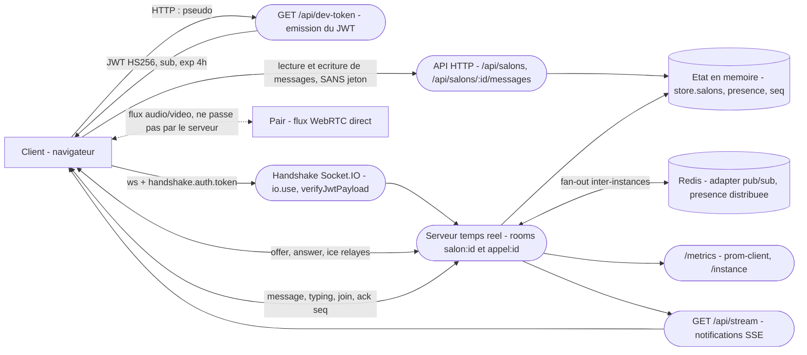

# Threat model - messagio (chat multi-salons temps réel)

> Périmètre : le serveur temps réel (`src/`), le handshake Socket.IO, les événements de canal,
> les routes REST de `src/rest.ts`, l'endpoint `/metrics`. Hors périmètre : le front de
> démonstration (`public/`), l'hébergement, le signaling WebRTC au-delà du relais.

## 1. Contexte et biens essentiels

`messagio` est un service de discussion instantanée organisé en salons, dont certains sont
**privés** (liste de membres explicite : `dev` est réservé à alice et bob). Il porte des messages
échangés entre personnes identifiées par un pseudonyme, une présence en temps réel (qui est là,
qui est en train d'écrire), et un relais de signaling WebRTC pour les appels en tête-à-tête.

> **Donnée personnelle.** Les messages sont échangés entre **personnes identifiées** par un
> pseudonyme stable, et la présence révèle les habitudes de connexion de chacun. Ce sont des
> données personnelles au sens du RGPD, et cette ligne sera reprise telle quelle dans le registre
> des traitements de S9.

| Bien essentiel | Pourquoi il compte | Événement redouté (EBIOS) | Gravité (1 à 4) |
| --- | --- | --- | --- |
| BE1 - contenu des messages des salons privés | conversations privées entre personnes identifiées ; leur divulgation est un incident de confidentialité et un incident RGPD | ER1 - lecture d'un salon privé par un tiers non membre | 4 |
| BE2 - identité des membres (le `sub` du jeton) | tout le contrôle d'accès aux salons en dépend ; une identité usurpée invalide toutes les autres protections | ER2 - usurpation de l'identité d'un membre, messages écrits en son nom | 4 |
| BE3 - intégrité de l'historique et de sa numérotation (`seq`) | le `seq` est la preuve que le serveur a enregistré un message et l'ordre dans lequel il l'a fait ; c'est ce qui rend l'historique opposable | ER3 - injection de messages non attribuables, historique non fiable | 3 |
| BE4 - disponibilité du canal et présence | un chat indisponible ou un canal saturé ne rend aucun service | ER4 - saturation du service par un client abusif | 2 |

## 2. Data flow diagram

Trust boundaries :

1. **Client et handshake.** Tout ce qui vient du client est hostile : l'en-tête `Origin`, le jeton
   de `handshake.auth`, et le `pseudo` passé à `/api/dev-token`.
2. **Handshake et canal ouvert.** La frontière propre au temps réel : la décision d'autorisation
   est prise **une fois**, le canal vit ensuite des heures. Les trois questions sont traitées
   ci-dessous.
3. **Canal et état partagé.** `store.salons`, la présence, le compteur `seq`. Un message accepté
   modifie un état que tous les autres clients de la room lisent.
4. **Serveur et dépendances externes.** Redis (adapter pub/sub, qui transporte `socket.data`
   sérialisé entre instances), `/metrics` et `/instance`.
5. **Canal et couche REST.** Frontière ajoutée après lecture du code : `src/rest.ts` accède aux
   **mêmes** salons que le canal, avec une politique d'autorisation différente — c'est-à-dire
   aucune. Voir la ligne #3 du tableau STRIDE.

### Frontière 2 - les trois questions, mesurées sur le code

**Que se passe-t-il quand le jeton expire alors que le canal est ouvert ?**
Rien. `io.use()` (`src/realtime/socketio-server.ts:125`) appelle `verifyJwtPayload` **une seule
fois**, au handshake, puis recopie `payload.sub` dans `socket.data.membre`. Aucun minuteur ne
referme la socket à l'échéance `exp`. Le jeton est émis avec `expiresIn: "4h"`
(`src/rest.ts:59`), mais un canal ouvert survit indéfiniment à cette expiration : la durée de vie
réelle de l'autorisation est celle de la connexion TCP, pas celle du jeton.

**Une autorisation de room accordée au `join` est-elle revérifiée à l'émission ?**
Partiellement, et c'est la bonne surprise du code. `roomAutorisee()` est appelée au `join`
(ligne 219) et à `appel:rejoindre` (ligne 293). À l'émission d'un `message`, le serveur ne se fie
pas au `salonId` annoncé mais vérifie `socket.rooms.has(room)` (ligne 360) : un client autorisé sur
`general` ne peut pas écrire dans `dev`. **En revanche**, cette vérification porte sur
l'appartenance à la room, pas sur le droit actuel : si la liste des membres du salon changeait,
`socket.rooms` resterait inchangé et l'émission serait toujours acceptée.

**Comment un socket déjà ouvert apprend-il qu'un droit vient d'être retiré ?**
Il ne l'apprend pas. Il n'existe aucun chemin, dans le code, pour forcer un `socket.leave()` ou une
déconnexion depuis un changement de la liste `salon.membres`. Retirer bob du salon `dev` n'a aucun
effet sur la socket que bob a déjà ouverte : il continue de recevoir tous les messages du salon
jusqu'à ce qu'il se déconnecte de lui-même. Avec l'adapter Redis, il faudrait de surcroît propager
l'ordre à **toutes** les instances.

## 3. Analyse STRIDE

| # | Élément / flux | Catégorie | Menace concrète | Exigence de sécurité | Priorité |
| --- | --- | --- | --- | --- | --- |
| 1 | `GET /api/dev-token` | Spoofing | La route délivre un JWT valide à **quiconque le demande**, avec le `sub` fourni en paramètre (`src/rest.ts:56`). Vérifié : `curl "…/api/dev-token?pseudo=alice"` renvoie un jeton `{"sub":"alice"}` signé. Aucune authentification n'a lieu nulle part dans le projet. | l'identité doit être établie par une preuve détenue par la personne (mot de passe, OAuth), jamais déclarée par l'appelant ; l'émission du jeton doit être séparée du service et authentifiée | H |
| 2 | Secret de signature du handshake | Spoofing | `export const SECRET = 'change-moi'` (`src/realtime/security-helpers.ts:49`), littéral versionné, servant **à la fois** à signer (`rest.ts:59`) et à vérifier (`socketio-server.ts:127`). Quiconque lit le dépôt forge un jeton pour n'importe quel `sub`. | secret lu dans l'environnement, absent du dépôt, rotationnable sans redéploiement ; démarrage refusé si la variable est absente | H |
| 3 | Routes REST `/api/salons/:id/messages` | Elevation of privilege | Le canal contrôle l'appartenance via `peutRejoindre()`, les routes REST **ne le font pas** (`src/rest.ts:27` et `:34`). Vérifié sans aucun jeton : `GET /api/salons/dev/messages` renvoie le contenu du salon privé (HTTP 200), et `POST` y insère un message signé `alice` (HTTP 201). | l'autorisation est une propriété de la ressource, pas du transport : toute porte d'accès aux salons applique `peutRejoindre()`, canal et REST compris | H |
| 4 | **Brique existante** - JWT au handshake (`io.use`) | Spoofing | *Instruite.* Le jeton est vérifié une fois, à l'ouverture. La brique établit correctement le `sub` et rejette un jeton invalide. **Sa borne** : le secret est celui de la ligne #2 ; `verifyJwtPayload` appelle `jwt.verify(token, secret)` **sans liste d'algorithmes** (`security-helpers.ts:22`), donc l'algorithme est choisi dans l'en-tête par l'appelant ; et l'expiration n'est jamais réévaluée sur un canal ouvert. | `algorithms: ['HS256']` explicite ; fermeture de la socket à l'échéance `exp` ; revérification périodique | H |
| 5 | **Brique existante** - autorisation par room | Elevation of privilege | *Instruite.* `roomAutorisee()` vérifie l'existence du salon et `peutRejoindre()` au `join` et à `appel:rejoindre` ; l'émission vérifie `socket.rooms.has(room)`, ce qui empêche d'écrire dans un salon non rejoint. **Sa borne** : elle protège le canal et **seulement** le canal (voir #3), elle repose sur une identité non authentifiée (voir #1), et un droit retiré n'est jamais propagé à une socket ouverte. | révocation propagée aux sockets ouvertes, toutes instances comprises ; autorisation revérifiée à l'émission, pas seulement l'appartenance à la room | H |
| 6 | **Brique existante** - contrôle d'origine | Spoofing | *Instruite.* `cors: { origin: ORIGINES_AUTORISEES }` (`socketio-server.ts:120`), liste configurable par `ORIGINES_AUTORISEES`. **Sa borne, décisive** : CORS n'est appliqué que par les **navigateurs**. Un client Node, `wscat` ou un script Python n'envoie pas d'`Origin`, ou en envoie un arbitraire, et se connecte sans obstacle. Cette brique protège contre le détournement depuis un site tiers, pas contre un attaquant direct. | ne pas compter l'origine comme un contrôle d'accès ; le seul contrôle qui vaut au handshake est le jeton (donc #1, #2, #4) | M |
| 7 | **Brique existante** - rate-limiting | Denial of service | *Instruite.* Un `RateLimiter` de 15 messages/s est créé **par socket** (`socketio-server.ts:158`), et le dépassement déconnecte (ligne 346). **Ses trois bornes** : il est par **socket** et non par identité, donc N connexions donnent N fois le quota avec le même jeton ; le compteur est remis à zéro toutes les secondes (fenêtre fixe), ce qui autorise une rafale double à cheval sur deux fenêtres ; il est local à l'instance, donc multiplié par le nombre d'instances derrière nginx. | quota agrégé par identité et partagé entre instances (compteur Redis) ; plafond du nombre de sockets par identité | M |
| 8 | Payload d'un `message` entrant | Tampering | `charge.texte` n'est borné ni en taille ni en forme (`socketio-server.ts:350`) : seul `trim()` et un test de non-vacuité sont appliqués. Un message de plusieurs mégaoctets est accepté, stocké et rediffusé à toute la room, puis à toutes les instances via Redis. | borne de taille explicite sur le texte, validation de schéma des charges entrantes, rejet par `ack` plutôt que troncature silencieuse | M |
| 9 | Événements de canal (`join`, `message`, `appel:*`) | Repudiation | Aucune trace horodatée et attribuée de qui a rejoint quel salon, ni de qui a émis quoi. Les seules écritures de journal sont deux `console.error` sur chemin d'erreur (lignes 276 et 313). En cas de contestation sur un message, rien ne permet de reconstituer la séquence. | journal d'audit append-only des événements d'autorisation et d'émission : horodatage, `sub`, room, identifiant de socket | M |
| 10 | `GET /metrics` et `GET /instance` | Information disclosure | Servis sans authentification (`src/realtime/scaling.ts:96` et `:100`). Vérifié : HTTP 200 sans jeton. Ils exposent le nombre de connectés, l'activité des rooms et l'identifiant d'instance — de quoi cartographier le déploiement et observer les habitudes de connexion. | endpoints restreints au réseau de supervision ou authentifiés ; jamais exposés par le proxy public | M |
| 11 | Snapshot renvoyé dans l'ack du `join` | Information disclosure | Le `join` renvoie les 30 derniers messages, ou **tout** l'historique depuis `depuisSeq` si le client l'annonce (`socketio-server.ts:248`). `depuisSeq` est fourni par le client : `depuisSeq: 1` rapatrie l'intégralité du salon. C'est acceptable pour un membre légitime, mais cela amplifie #1 et #3. | borne haute sur le volume renvoyé, indépendante de la valeur demandée par le client | L |
| 12 | Relais de signaling WebRTC | Tampering | `appel:offer`, `appel:answer` et `appel:ice` sont relayés sans lecture ni validation (`socketio-server.ts:321`), vers `socket.data.appel`. Le relais est correctement borné par `roomAutorisee()` à l'entrée et par `PARTICIPANTS_MAX`. La charge SDP/ICE reste néanmoins arbitraire et non validée. | valider la forme des charges relayées, ou documenter explicitement que le relais est opaque et que le client doit s'en défier | L |
| 13 | Dépendance `@fastify/static` | Elevation of privilege | La version installée est affectée par un *path traversal*, un *route guard bypass* et un *authorization bypass* (1 vulnérabilité **high**, `npm audit`). Correctif : `@fastify/static@10.1.3`, montée **majeure**. | montée planifiée ; en attendant, ne pas s'appuyer sur un garde de route de `@fastify/static` pour une décision de sécurité | M |

Couverture : Spoofing (1, 2, 4, 6), Tampering (8, 12), Repudiation (9), Information disclosure
(10, 11), Denial of service (7), Elevation of privilege (3, 5, 13).

## 4. Correspondance avec EBIOS RM

| Menace STRIDE | Événement redouté | Scénario de risque (source -> chemin -> impact) |
| --- | --- | --- |
| #1 Spoofing via `/api/dev-token` | ER2 - usurpation d'identité | attaquant externe non authentifié -> il appelle `GET /api/dev-token?pseudo=alice` -> il obtient un jeton valide au nom d'alice -> il ouvre un canal, rejoint légitimement le salon privé `dev` dont alice est membre, lit tout et écrit au nom d'alice -> ER1 et ER2 réalisés ensemble (BE1, BE2) |
| #2 Spoofing par secret en dur | ER2 - usurpation d'identité | toute personne ayant accès au dépôt (public, ou fuite) -> elle lit `SECRET = 'change-moi'` -> elle forge un jeton pour n'importe quel `sub`, sans même passer par la route d'émission -> même impact que #1, mais indétectable côté serveur et non révocable sans rotation du secret (BE2) |
| #3 Elevation of privilege par la couche REST | ER1 - lecture d'un salon privé | attaquant externe non authentifié -> `GET /api/salons/dev/messages` -> lecture intégrale du salon privé sans jeton ; puis `POST` avec `auteur: "alice"` -> injection d'un message attribué à un tiers -> divulgation (BE1) et perte de fiabilité de l'historique (BE3) |
| #4 Borne du JWT au handshake | ER2 - usurpation d'identité | attaquant disposant d'un jeton expiré ou d'un canal déjà ouvert -> l'expiration n'est jamais réévaluée -> maintien de l'accès au-delà de la durée prévue (BE2) |
| #5 Borne de l'autorisation par room | ER1 - lecture d'un salon privé | membre retiré du salon `dev` -> aucune propagation vers sa socket ouverte -> il continue de recevoir les messages du salon dont il vient d'être exclu (BE1) |

## 5. Suivi

| Ligne | Exigence H | Où elle est vérifiée |
| --- | --- | --- |
| #1 | identité prouvée, jamais déclarée | aucun outil ne peut le voir : finding de revue manuelle, à porter au rapport d'audit de **S8** avec la preuve `curl` rejouable |
| #2 | secret hors du dépôt | **S7** - règle Semgrep `rt-hardcoded-handshake-secret` (remonte `security-helpers.ts:49`) et gitleaks sur l'historique |
| #3 | autorisation portée par la ressource | **S7** - règle Semgrep personnelle `rt-route-salon-sans-controle-appartenance` (remonte `rest.ts:18`, `:27`, `:34`) |
| #4 | `algorithms` explicite, expiration honorée | **S7** - règle Semgrep `rt-jwt-verify-sans-algorithms` pour la partie algorithmes ; la partie expiration relève de **S8** |
| #5 | révocation propagée aux sockets ouvertes | aucun détecteur possible : **S8**, revue manuelle, puis plan de remédiation en **S9** |

Les lignes M et L (#6 à #13) sont portées au rapport d'audit de **S8**. La ligne #13 est suivie par
le job `deps-scan`, dont le seuil a été fixé à `moderate` pour ce projet.
